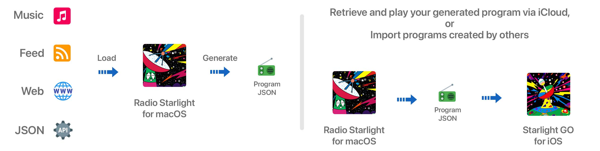
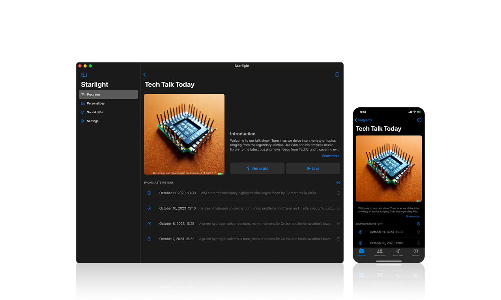

# ✨ Radio Starlight - Your Generative Radio Station

A Revolution in AI-Powered Radio Experiences for macOS and iOS

Radio Starlight and its companion player app, Starlight GO, merge AI's prowess with dynamic user personalization to redefine auditory media. At their core, these apps allow users to transform passive moments into enriching, tailored listening experiences. By blending Apple Music, News Feed, local weather, and now with the capability to pull content from JSON API and web pages, users get a harmonious mix of entertainment and real-time information on both desktop and mobile platforms.

https://radio-starlight.com  
https://apps.apple.com/us/app/starlight-go/id6468881126

## What it does

- Seamlessly blends Apple Music, news feeds, local weather, JSON API content, and web page data into an auditory experience. Your favorite tracks and incoming information aren't just played - they're discussed by a user-defined personality, merging entertainment and insights.
- Generates English radio programs from any language news source.
- Enhances listening with visuals, script texts, and news images.
- Empowered by OpenAI for dynamic and engaging content.
- Import, export, and share Programs, Personalities, and Sound Sets as JSON files, allowing users to exchange and collaborate on their listening experiences.

## Unique Traits

- Design a personalized voice that offers commentary and insights.
- On-the-fly program crafting.
- Amplify your experience with custom background Sound.
- DALL-E powered visuals for covers and avatars.

## Goals

- Build the most productive and most enjoyable information acquisition channel for humans.

## Roadmap

- Continuous program generation, 24/7.
- Creating custom program segments.
- Defining custom segment prompts.
- More LLM models.
- More languages.

## Contributions

- We welcome contributions from the community. 
- Feel free to open an issue. 

--- 

📁 Acknowledgements for Images in the diagram:  
<a target="_blank" href="https://icons8.com/icon/81TSi6Gqk0tm/music">Music</a> icon by <a target="_blank" href="https://icons8.com">Icons8</a> / 
<a target="_blank" href="https://icons8.com/icon/13841/rss">Feed</a> icon by <a target="_blank" href="https://icons8.com">Icons8</a> / 
<a target="_blank" href="https://icons8.com/icon/63807/website">Web</a> icon by <a target="_blank" href="https://icons8.com">Icons8</a> / 
<a target="_blank" href="https://icons8.com/icon/21895/rest-api">Rest API</a> icon by <a target="_blank" href="https://icons8.com">Icons8</a> / 
<a target="_blank" href="https://icons8.com/icon/12793/radio">Radio</a> icon by <a target="_blank" href="https://icons8.com">Icons8</a> / 
<a target="_blank" href="https://icons8.com/icon/12376/advance">Advance</a> icon by <a target="_blank" href="https://icons8.com">Icons8</a> 

