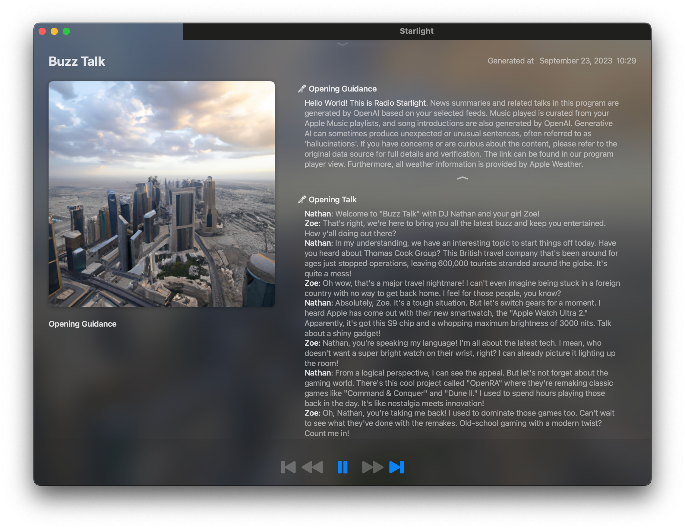

# Radio Starlight

A Revolution in AI-Powered Radio Experiences

Radio Starlight merges AI's prowess with dynamic user personalization to redefine auditory media. 
At its core, it allows users to transform passive moments into enriching, tailored listening experiences. 
By blending Apple Music, News Feed, local weather, and now with the capability to pull content from JSON API and web pages, 
users get a harmonious mix of entertainment and real-time information.

## Key highlights

1. **Powered by OpenAI**: Experience dynamic radio content with OpenAI's technology. Fresh, relevant, and tailored just for you. (This app requires your own API key)

2. **Universal News Source**: Did you know? You can generate an English program even from non-English news sources. Stay globally informed in your language!

3. **Speak Any Language**: Set your program's language preference, and we'll craft a broadcast in that language. From Spanish to Mandarin, we've got you covered!

4. **DALL-E 2 Imagery**: Create stunning program cover images and unique avatars for your radio personalities using the power of DALL-E 2. Stand out with style!

5. **Visual Radio**: While you listen, view the script text and accompanying news images right in the player. Engage both your ears and eyes!

6. **Craft Your Personality**: Want a radio host that's uniquely you? Design your own radio personality and let it echo your style and preferences.

7. **Listen On-the-Go**: No need to wait! Play your program even while it's generating. Seamless radio experiences, anytime.

8. **Original BGMs**: Set the mood with your own background music. Whether it's jazzy or pop, create a BGM that resonates with your vibe.

9. **Cost Transparency**: While Radio Starlight is free to use, be aware that the OpenAI API consumption is billed according to its usage.

In essence, Radio Starlight, with its suite of features, has the potential to reshape the way users consume news, music, and web content, turning the passive act of browsing into an immersive, personalized auditory journey. Whether for individual users or businesses, it's poised to make waves in the evolving digital media landscape.

## Installation

1. Download the [latest version]()
2. Open the DMG file and move the app to your Applications folder
3. Open the app and enjoy!

## Usage

See [User Guide](UserGuide/README.md) for more information.

## Contact 

info@radio-starlight.com  
https://twitter.com/ray_kitajima
